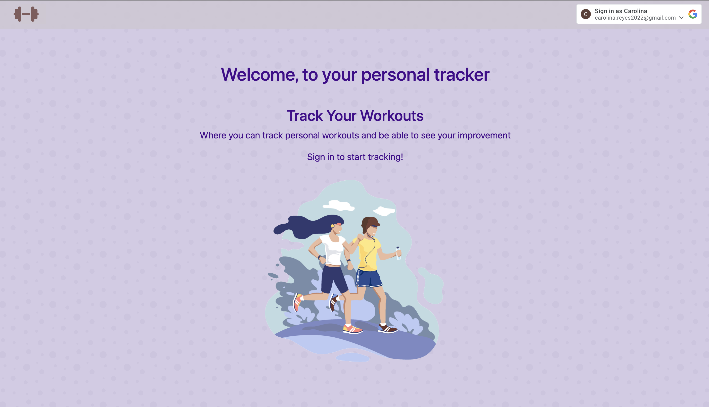
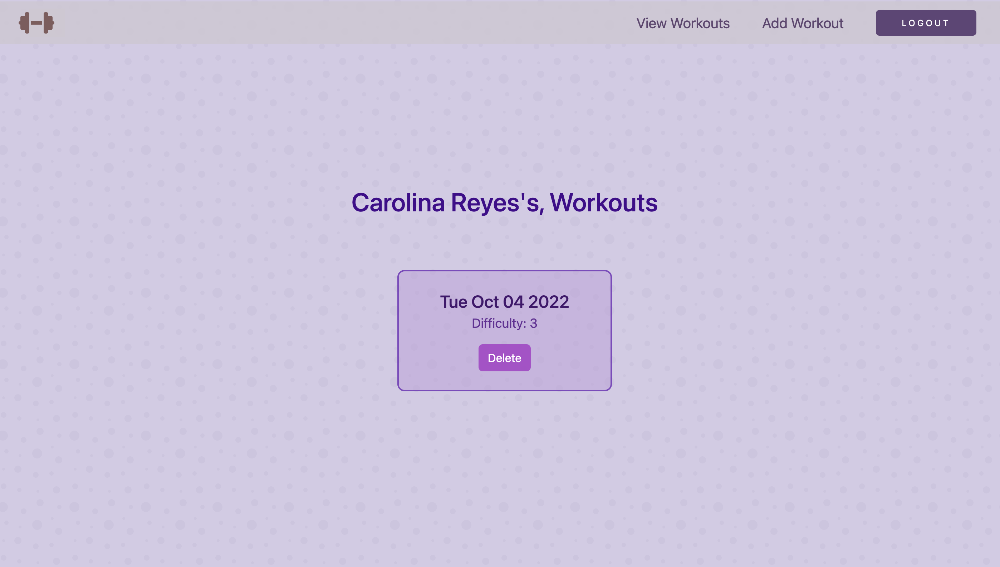

## __Title: Workout Tracker__ 

## Getting Started: #
  * Check out it [here](https://track-workouts.fly.dev/)

## Planning Materials
  * [Trello](https://trello.com/b/tcKyhibB/workout-tracker) 

## Screenshots: 
 
 
## Technologies Used: 
  * JavaScript
  * HTML
  * CSS
  * Express
  * EJS
  * Node.js
  * Google OAuth 
  * MongoDB
  * Mongoose
  * Bootstrap

## Credits: 
  * Background: https://heropatterns.com/
  * Fonts : https://fonts.google.com/
  * Buttons: https://uiverse.io/buttons
  * Homepage Image: https://www.vecteezy.com/

## Next Steps: 
  - [ ] Calendar view for workouts.
  - [ ] Implement dark mode.
  - [ ] Implement feature where user can add a exercise type.
  - [ ] Implement feadture where user can give feedbacks to workouts.